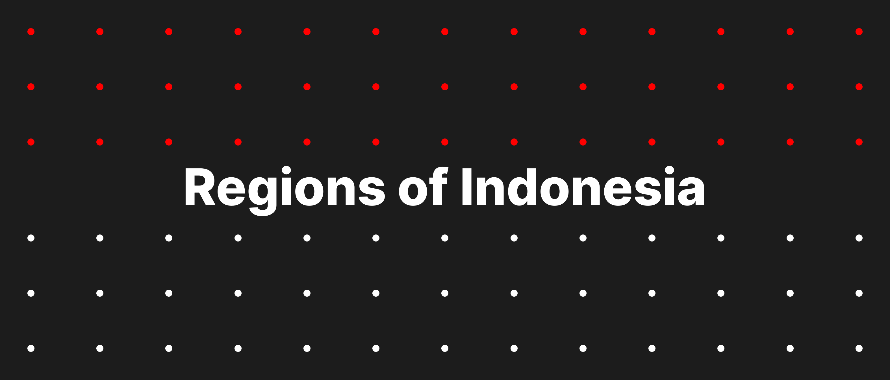

  
  

# Regions of Indonesia

Regions of Indonesia

## Packages

- [Data](https://github.com/regions-of-indonesia/data)
- [Client](https://github.com/regions-of-indonesia/client)

## LICENSE

GPL-3.0
